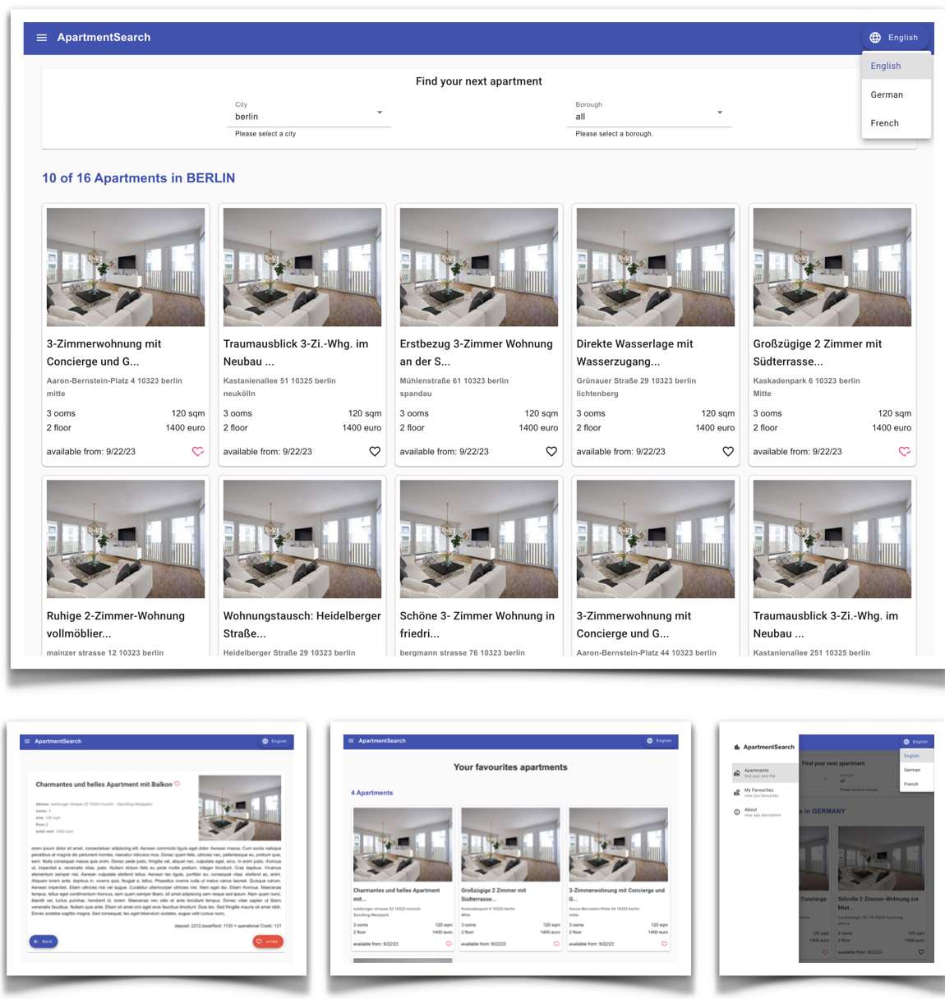

# Angular Architecture: ⚡ Signals ⚡

## Example project: Rental search app (ApartmentSearch).



> **Rental search app (ApartmentSearch)**
>
> A project designed to get started with Angular Enterprise Architecture and Signal-Based Component. All components are fully Signal-driven. Additionally, the project features a custom reactive state management built on Signals, ensuring efficient and predictable state handling.
>
> The user can search for apartments by the desired city and district, view detailed information about a selected apartment, and mark it as a favorite. Additionally, the app offers features such as language switching and more.
>
> This project represents a migration from a Component-First architecture (standalone) to a Signal-Based Component Architecture.

> Built using Angular CLI 19.0-6 & Json-server.

## Purpose
this project consists of writing a Angular with the purpose to learn how to design an Angular signal based application with a focus on maintaining sustainable development speed and the ease of adding new features in the long run, using a new Angular feature like Angular Deferrable Views and the Control Flow syntax.
This application present high-level recommendations for a well-designed Angular application architecture based on best practices and battle-tested patterns.

- Signal-based Component Architecture.
- Smart and Dumb components pattern.
- Reactive state management (using own Signal store).

## Implementation

This application provides a comprehensive learning experience by incorporating advanced Angular techniques and best practices.

🔹 **State Management with own Signal Store**: Understand how to use Signal to build own Store for modern state management.

🔹 **Creating Signal-Based Components**: build highly efficient, components using Angular Signals, eliminating unnecessary change detection cycles and improving performance.

🔹 **Preloading Configuration Files**: Learn how to dynamically load a configuration file before the app initializes, enabling flexible settings management without modifying the code.

🔹 **Custom SVG Icon Integration**: Implement a system for registering and using custom SVG icons within the application to enhance UI design and maintain scalability.

🔹 **Internationalization (i18n) with @ngx-translate/core**: Explore how to implement multilingual support efficiently using a third-party library, making the app accessible to users in different languages.

🔹 **Infinite Scrolling for Enhanced User Experience**: Learn to integrate infinite scrolling in a listing view, allowing users to load more data seamlessly as they scroll, improving performance and usability.

🔹 **Global Error Handling**: Implement a centralized error-handling mechanism to catch and manage errors globally, ensuring a robust and user-friendly web application.

🔹 **Dynamic Page Titles with Angular Router**: Set page titles dynamically using Angular Router.

## UI Features

- **Apartment Search Page**: browse available apartments.
- **Detailed Apartment Overview**: view comprehensive details about each apartment.
- **Multilingual Support**: the app supports internationalization in three languages, ensuring accessibility for a diverse audience.
- **Advanced Filtering:**: users can refine their search by city and borough, making it easier to find the perfect apartment. Additionally, more listings can be loaded dynamically via scrolling.
- **Favorites Management:** a dedicated favorites page allows users to quickly view and manage their saved apartments.
- **Favorites & Storage Sync**: save preferred apartments to a favorites list, which automatically syncs with local storage for easy access across sessions.

## Project Structure

```
src/
 │
 │────── app/
 │        │────── core/
 │        │         │────── components/
 │        │         │────── containers/
 │        │         │────── config/
 │        │         │────── helpers/
 │        │         │────── interceptors/
 │        │         │────── models/
 │        │         │────── services/
 │        │         │────── store/
 │        │
 │        │────── features/
 │        │         │
 │        │         │────── apartments
 │        │         │         │────── components/
 │        │         │         │────── containers/
 │        │         │         │────── guards/
 │        │         │         │────── models/
 │        │         │         │────── services/
 │        │         │         │────── store/
 │        │         │         │────── helpers/
 │        │         │         │────── config/
 │        │         │         │────── pipes/
 │        │         │
 │        │────── shared/
 │        │         │────── core/
 │        │         │         │────── components/
 │        │         │         │────── pipes/
 │        │         │         │────── services/
 │        │         │         │────── state/
 │        │         │
 │        │         │────── functional/
 │        │         │         │────── trasnlation/
 │        │
 │        │ app.components.ts
 │        │ app.config.ts
 │        │ app.routes.ts
 │
 │────── styles/
 │        │────── .../
 │
 │ main.ts
 │ index.html
 │ styles.scss
```

## Try it

1 - Run first `npm ci`.  
2 - Run `npm start` for a dev server and then `npm run db` for database.  
3 - Navigate to `http://localhost:4200/`.

The application will automatically reload if you change any of the source files.

_**Or run it in prod mode:**_

1. Run first `npm ci`.
2. Run `npm run build` for build the app.
3. Run `npm run start-server` for a prod server and then `npm run db` for run database.
4. Navigate to `http://localhost:8080/`.


## Version
This project was generated with:

angular-cli: `19.0.6`

node: `^20.13.0`

npm: `^10.9.1`

